# 同济大学编译原理课程项目
成员：

2354323 谭兆辰

2253713 戴金瓯

2352031 古振

2353914 韩一墨

## 项目介绍


## 测试

### 编译器生成器测试步骤（A类测试）
```
cd Compiler
.\compiler.exe <源代码> <词法分析文件> <语法分析文件>
```
示例：
```
cd Compiler
.\compiler.exe ..\Lexical_analyzer\test_c_like.txt ..\Lexical_analyzer\rules\c_like.lex ..\Syntactic_analyzer\MiniC.grammar
```
类C语言测试如下：
### 测试用例设计与结果展示
#### 成功示例
```
int a=0;
int b=1;
int main() {
    int _sab = 0;
    int a = 123;
    while (_sab <= 10 + b) {
        _sab = _sab + 1;
        while(_sab < 20){
            _sab = _sab + 2;
        }
    }
    if(a != 2){
        a=2;
    }
    return 0;
}
```
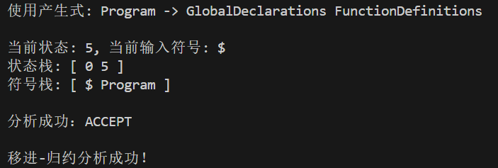
#### 未定义字符
```
int a=3#4;
```
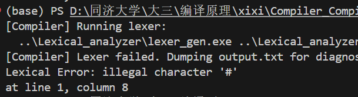
#### 不支持的符号组合
```
int a = 2;
int b = 1;
int c = a ! b;
```
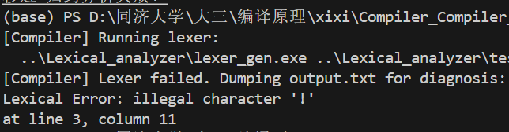
#### 以数字开头的标识符
```
int 3abc;
```
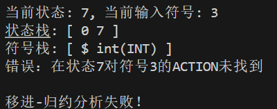
#### 标识符中包含非法字符
```
int a-b;
```
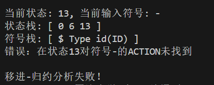
#### 关键字拼写错误
```
innt a;
whlie (a < b) {}
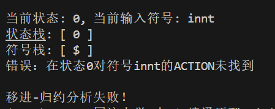
```
#### 数字后直接字母
```
int a = 123abc;
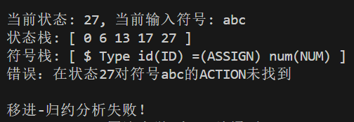
```
#### 非法数字格式
```
int b = 1.2;
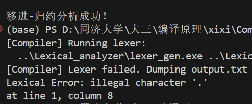
```
#### 连续运算符
```
int main(){
    int a=1;
    int b=2;
    if(a === b){
        return 0;
    }
    return 0;
}
```
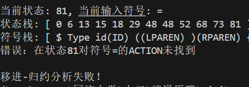

Tiny语言测试如下：
#### 成功示例
```
read x;
read y;
if ( x < y )
    write x;
else
    write y;
while ( x < 10 )
    x := x;
```
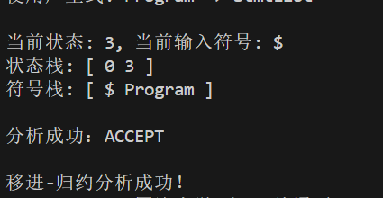
#### 未定义标识符
```
read x;
read y;
if ( x < y )
    wwwte x;
else
    write y;
while ( x < 10 )
    x := x;
```
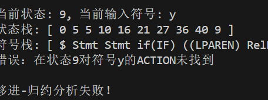

简单表达式语言测试如下：

#### 成功示例
```((12+34)*5-6)/(7-8*9)```

#### 额外多符号运算
```((12+34)*5-6)/(7-8*9)/*/```
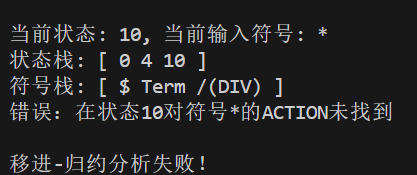
### 测试生成的编译器步骤（B类测试）
```
cd Compiler
.\compiler_IR.exe <源代码> <词法分析文件> <语法分析文件>
```
示例：
```
cd Compiler
.\compiler_IR.exe ..\Lexical_analyzer\test_c_like.txt ..\Lexical_analyzer\rules\c_like.lex ..\Syntactic_analyzer\MiniC.grammar
```
### 测试用例设计与结果展示

#### 成功示例
```
int a=0;
int b=1;
int main() {
    int _sab = 0;
    int a = 123;
    while (_sab <= 10 + b) {
        _sab = _sab + 1;
        while(_sab < 20){
            _sab = _sab + 2;
        }
    }
    if(a != 2){
        a=2;
    }
    return 0;
}
```
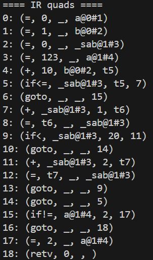

#### 重定义
```
int main(){
    int a;
    int a;
    return 0;
}
```
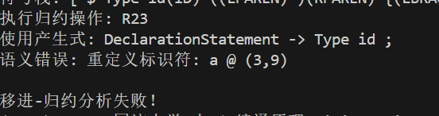
#### 作用域错误
```
int main(){
    int a = 2;
    while(a < 3){
        a = a + 1;
        int b = 2;
    }
    b = 1;
    return 0;
}
```
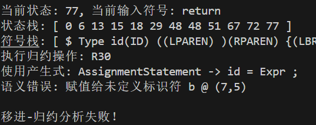
#### 未声明标识符
```
int main(){
    int a=2;
    b=3;
    return 0;
}
```
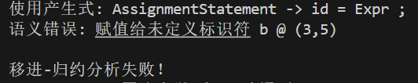
#### int函数测试
```
int minn(int a){
    a=3;
    int b=4;
    return a+b;
}

int main(){
    int a=2;
    return 0;
}
```
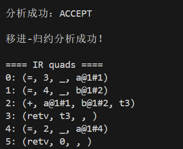
#### 函数返回类型不匹配测试
```
void minn(int a){
    a=3;
    int b=4;
    return a+b;
}

int main(){
    int a=2;
    return 0;
}
```

#### void类型函数测试
```
void minn(int a){
    a=3;
    int b=4;
    return ;
}

int main(){
    int a=2;
    return 0;
}
```
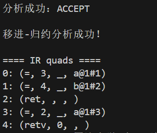
#### 第二种中间代码生成的成功测试
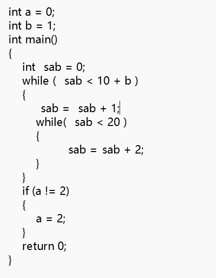
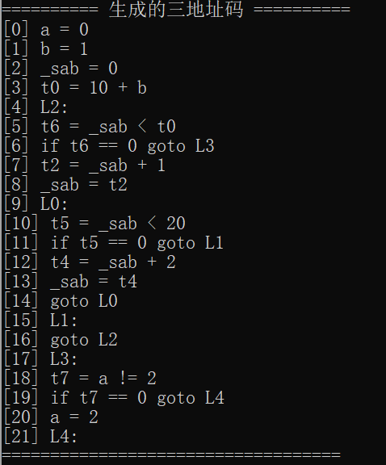